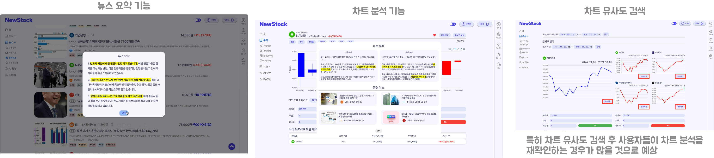

# Newstock
뉴스와 함께 하는 똑똑한 투자! “**NewStock**”

경제 뉴스로 투자 안목을 키우고, 모의 투자로 실전 감각까지 다지는 빅데이터 플랫폼

`SSAFY 11th 빅데이터(분산) PJT`

`개발기간: 24.08.26 ~ 24.10.11 (7주)`

### [프로젝트 전체 리드미](https://github.com/ssafy-newstock/newstock)

# 주요기능 🔍

### 📌 뉴스 제공 기능

    - Newstock은 경제 뉴스를 "시황 뉴스"와 "종목 뉴스"로 구분하여 제공합니다.
      - 시황 뉴스: 경제와 금융 시장의 거시적인 흐름을 보여주는 뉴스
      - 종목 뉴스: 특정 기업이나 종목의 실적, 이슈와 관련된 뉴스
    - 감정 분석 기술을 통해 뉴스가 긍정적인지 부정적인지를 파악하여 사용자가 더 나은 투자 결정을 할 수 있도록 지원합니다.

### 📌 모의 투자 기능

    - 실제 주식 시장 데이터를 기반으로 가상 포인트를 사용해 모의 투자를 할 수 있습니다.
    - 차트 검색 기능: 사용자가 설정한 기간의 뉴스와 시황을 자동으로 분석 및 요약하여 복잡한 시장 정보를 한눈에 파악할 수 있습니다.
    - 차트 유사도 분석: 과거 주가 패턴과 유사한 차트를 찾아 제공하며, 당시의 뉴스와 시황도 요약해서 보여줍니다.

### 📌 편의 기능

    - 스크랩 기능: 원하는 뉴스를 저장할 수 있습니다.
    - AI 챗봇 기능: 검색 증강 생성을 활용해 필요한 정보를 빠르게 찾을 수 있도록 돕습니다.
    - 랭킹 시스템: 모의 투자에서 높은 수익을 기록한 사용자를 위한 게이미피케이션 요소를 추가했습니다.

# 💻 담당 역할
  - 리액트 쿼리를 활용한 응답 데이터 캐싱으로 LLM API 비용 효율성 개선
  - 주식 관련 페이지 구현 (전체 종목 조회 및 검색 기능, 분야별 주식 조회, 주식 종목 상세페이지)
  - 주가 변화에 따른 주식 차트 시각화(실시간, 월봉 캔들 차트)
  - 모의 주식 매도, 매수 기능 API 연결 및 구현
  - 주식 차트 분석, 주식 차트 유사도 검색, 뉴스 요약하기 기능 API 연결 및 구현
  - 종목 뉴스와 관련 주식 종목 매핑 및 주식 상세 페이지 이동 기능 연결
  - 전체 페이지 스켈레톤 UI 구현 및 선언적 데이터 관리로 사용자 경험 향상
  - styled componet를 활용한 라이트, 다크 모드 구현
  - 로그인 기능 연결 및 zustand를 통한 로그인/로그아웃 유저 상태 관리
  - ESLint, Prettier 설정 등 프론트 개발 환경 세팅
  - Figma를 활용한 와이어프레임 및 디자인 구성

 
📢 페이지 상세설명

 

 

## 기능 GIF
### 3줄 요약

### 실시간 주식

### 모의투자

### 차트 분석

### 유사도 검색

## 기능 시연 영상
### 주식 기능-1
https://github.com/user-attachments/assets/85e95ce5-fd05-4e6d-b0d1-77e6d3392a21

### 주식 기능-2
https://github.com/user-attachments/assets/22e0ecf8-2faa-436d-af34-8a998cb39291

### 다크모드
https://github.com/user-attachments/assets/8b02bdad-dfdf-4164-9f63-8914ff309622

# 🛠 기술 스택

### Frontend

### 기술 선정 이유
- Tanstack Query : 5년간의 뉴스 데이터 수집 및 활용, 코스피 전종목 주식 데이터를 메모리에 캐싱하여 데이터를 효율적으로 관리하고 최적화된 사용자 경험을 제공할 수 있을 것이라고 기대함
- Typescript : 첫번째 프로젝트에서 Javascript를 사용하면서 겪었던 런타임 에러를 컴파일 시점에서 에러를 예방하고 수정하고자 Typescript를 도입함
- styled-component : CSS-in-JS 방식으로 컴포넌트와 스타일을 함께 관리하여 재사용성과 유지보수성을 향상시키고 다크/라이트 모드를 구현하는 데 ThemeProvider를 활용하여 효율적이고 일관적인 UI를 구현할 수 있을 것이라 생각함

# 📚 배운점
- 사용자 경험에 대한 고려
  - 뉴스, 주식 데이터 캐싱으로 사용자 편의성 향상
  - 스켈레톤 UI와 선언적 데이터 관리를 통해 로딩, 에러 측면에서 사용자에게 일관된 경험 제공
- 깃랩 이슈 관리 및 코드 리뷰 활성화
  - 협업 과정에서의 미숙함, 기능을 구현에만 치중하여 유지 보수성을 고려하지 못한 코드 작성에 대한 아쉬움 해소
  - 팀원의 개인적인 이슈로 역할 재분담이 필요한 상황에서 많은 도움이 됨

- 데이터 캐싱

LLM API를 사용하는 기능의 경우 긴 로딩 시간과 LLM API 호출 비용 문제

  ### -> Tanstack Query 도입으로 LLM API 호출을 최소화하여 LLM API 비용 절감

  - 이외에도 Tanstack Query 활용한 기능
    - 낙관적 업데이트를 통한 주식 관심 종목의 즉각적인 UI 제공
    - InvalidateQuery 사용으로 보유 주식 최신화로 사용자 편의성 향상
    - isLoading 등 선언적 데이터 관리로 로딩 화면(스켈레톤 UI) 구현
